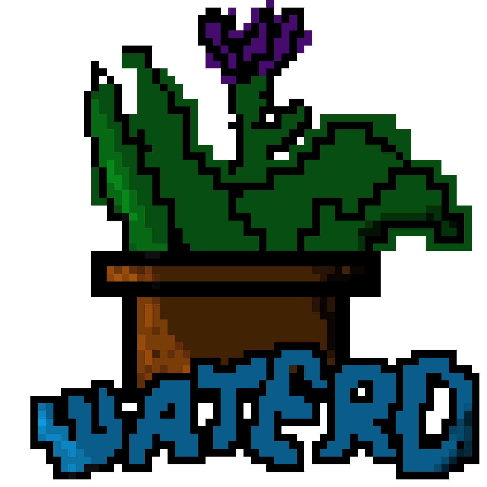
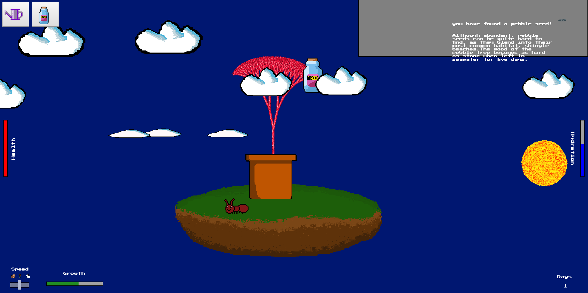
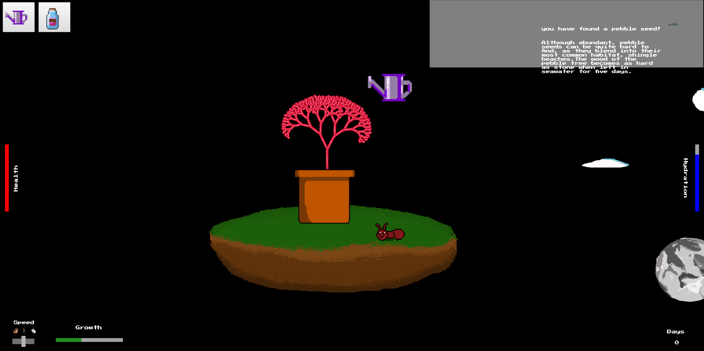

# Waterd
## Waterd - Look after your very own online plant!

# How to get the game

There are a couple of ways to play the game:

## The easy way

The simplest way to play Waterd is by going to [https://waterdapp.github.io](https://waterdapp.github.io), and after a few seconds the game will load up.

## The slightly harder way

You can also play Waterd on your computer.

### Requirements:

* Git (get from [here](https://git-scm.com/downloads))
* Node.js and NPM, downloadable in a single package from [here](https://nodejs.org/en/)

### How to install Waterd:

1. Open your Git command line and use cd to move to a suitable directory to install Waterd to.
2. Perform `git clone https://github.com/waterdapp/waterdapp.github.io.git`.
3. Perform `cd .\waterdapp.github.io\` to move into the diirectory.
4. Run `npm install` and `npm run dev`.
5. Waterd should open in your default browser.

### How to run Waterd again after being installed:

1. Open your Git command and use cd to move to the waterdapp.github.io directory.
2. Perform `git fetch` and `git pull` to make sure that you have the latest version installed.
3. Run `npm install` and `npm run dev` to open it.

# How to play the game

See how to play the game by clicking [here](https://waterdapp.github.io/about.html).

**Have fun!**